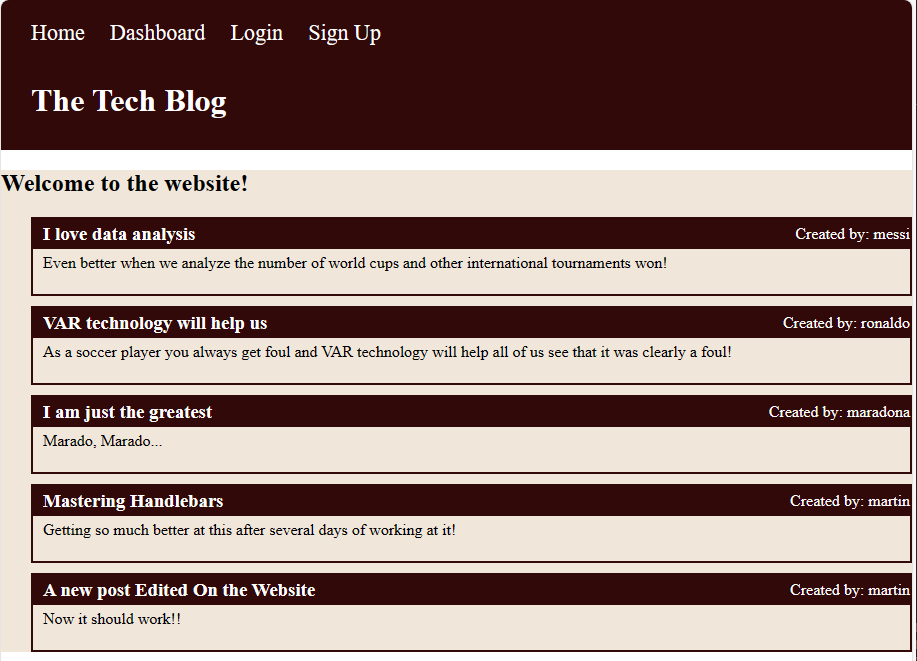

# CMS Blog Site

## Github Repo Link
https://github.com/FullPersonDev/cmsblogsite

## Mock-up

- Homepage Site

- Logged In.  My Dashboard View

## Heroku Errors
The Heroku service is not working and I cannot log in.  I tried several days and resetting password.  But unfortunately I get this same message error from them, and I cannot log in to deploy my work there.

